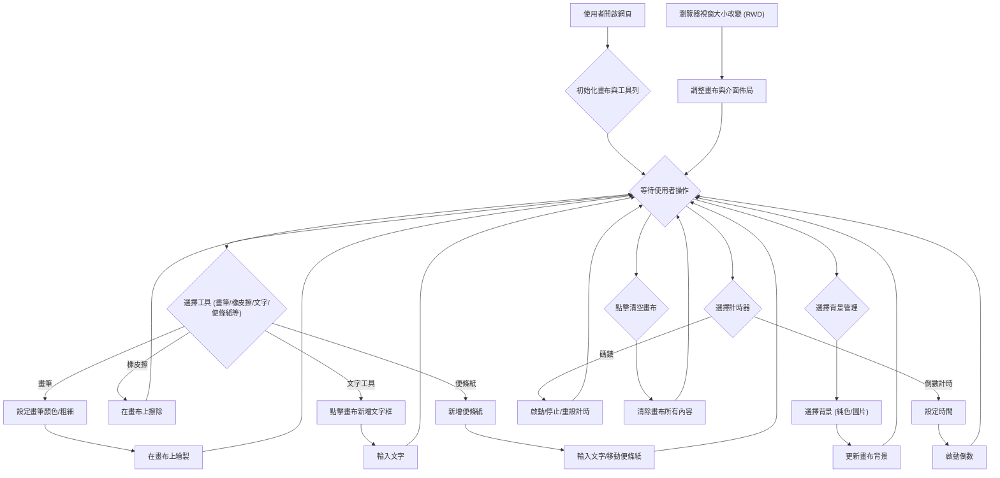

```mermaid
graph TD
    A["使用者開啟網頁"] --> B{"初始化畫布與工具列"};
    B --> C{"等待使用者操作"};

    C --> D{"選擇工具 (畫筆/橡皮擦/文字/便條紙等)"};
    D -- "畫筆" --> E["設定畫筆顏色/粗細"];
    E --> F["在畫布上繪製"];
    F --> C;

    D -- "橡皮擦" --> G["在畫布上擦除"];
    G --> C;

    D -- "文字工具" --> H["點擊畫布新增文字框"];
    H --> I["輸入文字"];
    I --> C;

    D -- "便條紙" --> J["新增便條紙"];
    J --> K["輸入文字/移動便條紙"];
    K --> C;

    C --> L{"選擇背景管理"};
    L --> M["選擇背景 (純色/圖片)"];
    M --> N["更新畫布背景"];
    N --> C;

    C --> O{"選擇計時器"};
    O -- "倒數計時" --> P["設定時間"];
    P --> Q["啟動倒數"];
    Q --> C;
    O -- "碼錶" --> R["啟動/停止/重設計時"];
    R --> C;

    C --> S{"點擊清空畫布"};
    S --> T["清除畫布所有內容"];
    T --> C;

    U["瀏覽器視窗大小改變 (RWD)"] --> V["調整畫布與介面佈局"];
    V --> C;
``` 