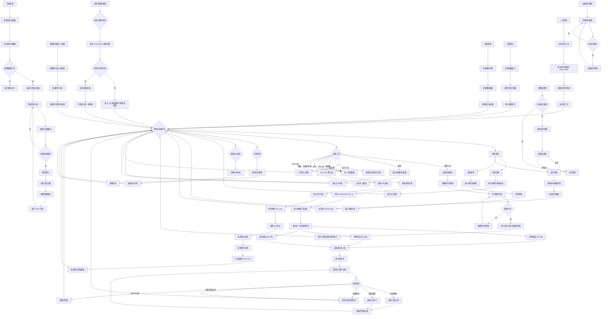

```mermaid
graph TD
    A["使用者開啟網頁"] --> B{"初始化應用程式"};
    B --> B1["檢查 localStorage 專案資料"];
    B1 --> B2{"是否有現有專案?"};
    B2 -->|是| B3["載入上次專案或顯示專案選擇器"];
    B2 -->|否| B4["顯示歡迎畫面"];
    B3 --> C{"等待使用者操作"};
    B4 --> B5["引導建立第一個專案"];
    B5 --> C;

    %% 專案管理流程
    C --> PM["專案管理"];
    PM --> PM1["新增專案"];
    PM1 --> PM2["輸入專案名稱和描述"];
    PM2 --> PM3["建立空白畫布"];
    PM3 --> C;
    
    PM --> PM4["開啟專案"];
    PM4 --> PM5["顯示專案選擇器"];
    PM5 --> PM6["選擇專案"];
    PM6 --> PM7["載入專案內容"];
    PM7 --> C;
    
    PM --> PM8["儲存專案"];
    PM8 --> PM9["收集所有模組資料"];
    PM9 --> PM10["生成畫布縮圖"];
    PM10 --> PM11["儲存到 localStorage"];
    PM11 --> C;

    %% 工具選擇流程
    C --> D{"選擇工具"};
    D -- "游標工具" --> D0["啟用選擇模式"];
    D0 --> D01["隱藏所有控制項"];
    D01 --> D02["等待點擊內容"];
    D02 --> D03{"點擊內容?"};
    D03 -->|是| D04["顯示該內容的3按鈕控制項"];
    D03 -->|否| D05["隱藏所有控制項"];
    D04 --> D06["可進行移動/縮放/刪除操作"];
    D05 --> D02;
    D06 --> C;
    
    D -- "畫筆" --> E["設定畫筆顏色/粗細"];
    E --> F["在畫布上繪製"];
    F --> C;

    D -- "橡皮擦" --> G["在畫布上擦除"];
    G --> C;

    D -- "文字工具" --> H["點擊畫布新增文字框"];
    H --> I["輸入文字內容"];
    I --> C;

    %% 統一控制邏輯流程 (BaseControlModule)
    D -- "便條紙" --> UC["統一控制邏輯"];
    D -- "YouTube" --> UC;
    D -- "圖片" --> UC;
    D -- "倒數計時器" --> UC;
    D -- "碼錶" --> UC;
    
    UC --> UC1["點擊畫布位置"];
    UC1 --> UC2["呼叫 createElement(x, y)"];
    UC2 --> UC3["建立對應元素容器"];
    UC3 --> UC4["建立統一3按鈕控制項"];
    UC4 --> UC5["移動按鈕 (左上角)"];
    UC4 --> UC6["刪除按鈕 (右上角)"];
    UC4 --> UC7["縮放按鈕 (右下角)"];
    UC5 --> UC8["自動選中新元素"];
    UC6 --> UC8;
    UC7 --> UC8;
    UC8 --> UC9["顯示控制項"];
    UC9 --> UCO["使用者可進行操作"];
    
    %% 統一控制操作流程
    UCO --> UCO1{"操作類型"};
    UCO1 -- "拖拽移動" --> UCO2["更新元素位置"];
    UCO1 -- "縮放調整" --> UCO3["更新元素尺寸"];
    UCO1 -- "點擊刪除" --> UCO4["移除元素和控制項"];
    UCO1 -- "按Delete鍵" --> UCO4;
    UCO1 -- "點擊其他位置" --> UCO5["隱藏控制項"];
    UCO2 --> UCO6["更新控制項位置"];
    UCO3 --> UCO6;
    UCO4 --> C;
    UCO5 --> C;
    UCO6 --> UCO;

    D -- "QR Code" --> QR["QR Code 產生器"];

    %% 背景管理
    C --> L{"背景管理"};
    L --> M["選擇背景類型"];
    M --> N["更新畫布背景"];
    N --> C;

    %% 清空功能
    C --> S{"點擊清空畫布"};
    S --> T["清除所有內容"];
    T --> U["重繪背景"];
    U --> C;

    %% RWD 響應
    V["瀏覽器視窗大小改變"] --> W["調整畫布與介面佈局"];
    W --> X["重繪所有內容"];
    X --> Y["更新所有控制項位置"];
    Y --> C;

    %% QR Code 流程
    QR --> QR1["開啟 QR 面板"];
    QR1 --> QR2["輸入文字內容"];
    QR2 --> QR3["即時預覽 QR code"];
    QR3 --> QR4["調整大小設定"];
    QR4 --> QR5["點擊產生按鈕"];
    QR5 --> QR6["點擊畫布放置"];
    QR6 --> QR7["生成並顯示 QR code"];
    QR7 --> QR8["使用原有控制邏輯"];
    QR8 --> C;

    %% 音量偵測流程
    MIC["音量偵測"] --> MIC1["點擊麥克風按鈕"];
    MIC1 --> MIC2["請求麥克風權限"];
    MIC2 --> MIC3{"權限獲取成功?"};
    MIC3 -->|是| MIC4["初始化音頻分析器"];
    MIC3 -->|否| MIC5["顯示錯誤提示"];
    MIC4 --> MIC6["開始音量分析"];
    MIC6 --> MIC7["更新音量條顯示"];
    MIC7 --> MIC8{"音量超過閾值?"};
    MIC8 -->|是| MIC9["觸發警告"];
    MIC8 -->|否| MIC6;
    MIC9 --> MIC10["增加警告計數"];
    MIC10 --> MIC11["鈴鐺震動動畫"];
    MIC11 --> MIC12["顯示 Toast 警告"];
    MIC12 --> MIC6;
    
    %% 閾值調整流程
    THRESHOLD["閾值調整"] --> TH1["拖拽閾值滑桿"];
    TH1 --> TH2["更新閾值數值"];
    TH2 --> TH3["移動指示線位置"];
    TH3 --> C;
    
    %% 警告重置流程
    RESET["重置警告"] --> RS1["點擊鈴鐺圖示"];
    RS1 --> RS2["重置警告計數器"];
    RS2 --> RS3["顯示重置提示"];
    RS3 --> C;

    %% 工具切換時的統一控制處理
    SWITCH["工具切換"] --> SW1["停用目前工具"];
    SW1 --> SW2["呼叫所有模組的 deactivate()"];
    SW2 --> SW3["隱藏所有控制項"];
    SW3 --> SW4["啟用新工具"];
    SW4 --> C;

    %% 專案自動儲存
    AUTO["自動儲存機制"] --> AUTO1["定時檢查變更"];
    AUTO1 --> AUTO2{"內容有變更?"};
    AUTO2 -->|是| AUTO3["自動儲存專案"];
    AUTO2 -->|否| AUTO1;
    AUTO3 --> AUTO1;

    %% 瀏覽器關閉提醒
    CLOSE["瀏覽器關閉"] --> CLOSE1{"有未儲存變更?"};
    CLOSE1 -->|是| CLOSE2["顯示儲存提醒"];
    CLOSE1 -->|否| CLOSE3["正常關閉"];
    CLOSE2 --> CLOSE4["使用者選擇"];
    CLOSE4 -->|儲存| PM8;
    CLOSE4 -->|不儲存| CLOSE3;
``` 