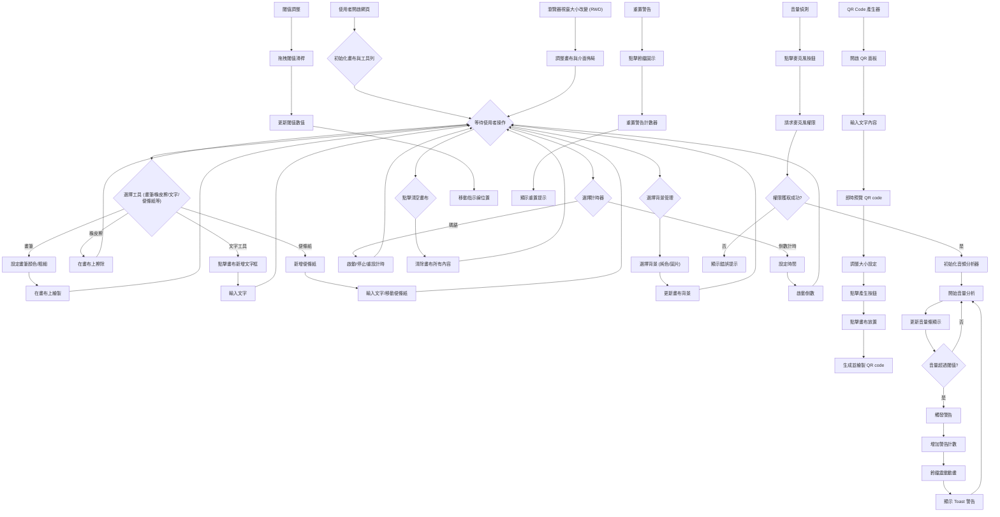

```mermaid
graph TD
    A["使用者開啟網頁"] --> B{"初始化畫布與工具列"};
    B --> C{"等待使用者操作"};

    C --> D{"選擇工具 (畫筆/橡皮擦/文字/便條紙等)"};
    D -- "畫筆" --> E["設定畫筆顏色/粗細"];
    E --> F["在畫布上繪製"];
    F --> C;

    D -- "橡皮擦" --> G["在畫布上擦除"];
    G --> C;

    D -- "文字工具" --> H["點擊畫布新增文字框"];
    H --> I["輸入文字"];
    I --> C;

    D -- "便條紙" --> J["新增便條紙"];
    J --> K["輸入文字/移動便條紙"];
    K --> C;

    C --> L{"選擇背景管理"};
    L --> M["選擇背景 (純色/圖片)"];
    M --> N["更新畫布背景"];
    N --> C;

    C --> O{"選擇計時器"};
    O -- "倒數計時" --> P["設定時間"];
    P --> Q["啟動倒數"];
    Q --> C;
    O -- "碼錶" --> R["啟動/停止/重設計時"];
    R --> C;

    C --> S{"點擊清空畫布"};
    S --> T["清除畫布所有內容"];
    T --> C;

    U["瀏覽器視窗大小改變 (RWD)"] --> V["調整畫布與介面佈局"];
    V --> C;

    QR["QR Code 產生器"]
    QR --> QR1["開啟 QR 面板"]
    QR1 --> QR2["輸入文字內容"]
    QR2 --> QR3["即時預覽 QR code"]
    QR3 --> QR4["調整大小設定"]
    QR4 --> QR5["點擊產生按鈕"]
    QR5 --> QR6["點擊畫布放置"]
    QR6 --> QR7["生成並繪製 QR code"]

    %% 音量偵測流程
    MIC["音量偵測"]
    MIC --> MIC1["點擊麥克風按鈕"]
    MIC1 --> MIC2["請求麥克風權限"]
    MIC2 --> MIC3{"權限獲取成功?"}
    MIC3 -->|是| MIC4["初始化音頻分析器"]
    MIC3 -->|否| MIC5["顯示錯誤提示"]
    MIC4 --> MIC6["開始音量分析"]
    MIC6 --> MIC7["更新音量條顯示"]
    MIC7 --> MIC8{"音量超過閾值?"}
    MIC8 -->|是| MIC9["觸發警告"]
    MIC8 -->|否| MIC6
    MIC9 --> MIC10["增加警告計數"]
    MIC10 --> MIC11["鈴鐺震動動畫"]
    MIC11 --> MIC12["顯示 Toast 警告"]
    MIC12 --> MIC6
    
    %% 閾值調整流程
    THRESHOLD["閾值調整"]
    THRESHOLD --> TH1["拖拽閾值滑桿"]
    TH1 --> TH2["更新閾值數值"]
    TH2 --> TH3["移動指示線位置"]
    
    %% 警告重置流程
    RESET["重置警告"]
    RESET --> RS1["點擊鈴鐺圖示"]
    RS1 --> RS2["重置警告計數器"]
    RS2 --> RS3["顯示重置提示"]

    %% 計時器流程
``` 