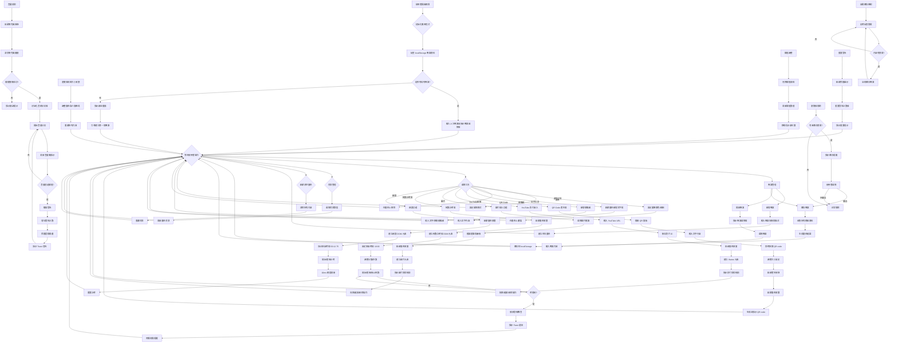

```mermaid
graph TD
    A["使用者開啟網頁"] --> B{"初始化應用程式"};
    B --> B1["檢查 localStorage 專案資料"];
    B1 --> B2{"是否有現有專案?"};
    B2 -->|是| B3["載入上次專案或顯示專案選擇器"];
    B2 -->|否| B4["顯示歡迎畫面"];
    B3 --> C{"等待使用者操作"};
    B4 --> B5["引導建立第一個專案"];
    B5 --> C;

    %% 專案管理流程
    C --> PM["專案管理"];
    PM --> PM1["新增專案"];
    PM1 --> PM2["輸入專案名稱和描述"];
    PM2 --> PM3["建立空白畫布"];
    PM3 --> C;
    
    PM --> PM4["開啟專案"];
    PM4 --> PM5["顯示專案選擇器"];
    PM5 --> PM6["選擇專案"];
    PM6 --> PM7["載入專案內容"];
    PM7 --> C;
    
    PM --> PM8["儲存專案"];
    PM8 --> PM9["收集所有模組資料"];
    PM9 --> PM10["生成畫布縮圖"];
    PM10 --> PM11["儲存到 localStorage"];
    PM11 --> C;

    %% 工具選擇流程
    C --> D{"選擇工具"};
    D -- "游標工具" --> D0["設定選擇模式"];
    D0 --> C;
    
    D -- "畫筆" --> E["設定畫筆顏色/粗細"];
    E --> F["在畫布上繪製"];
    F --> C;

    D -- "橡皮擦" --> G["在畫布上擦除"];
    G --> C;

    D -- "文字工具" --> H["點擊畫布新增文字框"];
    H --> I["輸入文字內容"];
    I --> C;

    D -- "便條紙" --> J["新增便條紙"];
    J --> K["輸入文字/移動便條紙"];
    K --> C;

    D -- "QR Code" --> QR["QR Code 產生器"];
    D -- "YouTube" --> YT["YouTube 影片嵌入"];
    D -- "圖片" --> IMG["圖片插入功能"];
    D -- "倒數計時器" --> CD["倒數計時器"];
    D -- "碼錶" --> SW["碼錶功能"];

    %% 背景管理
    C --> L{"背景管理"};
    L --> M["選擇背景類型"];
    M --> N["更新畫布背景"];
    N --> C;

    %% 清空功能
    C --> S{"點擊清空畫布"};
    S --> T["清除所有內容"];
    T --> U["重繪背景"];
    U --> C;

    %% RWD 響應
    V["瀏覽器視窗大小改變"] --> W["調整畫布與介面佈局"];
    W --> X["重繪所有內容"];
    X --> C;

    %% QR Code 流程
    QR --> QR1["開啟 QR 面板"];
    QR1 --> QR2["輸入文字內容"];
    QR2 --> QR3["即時預覽 QR code"];
    QR3 --> QR4["調整大小設定"];
    QR4 --> QR5["點擊產生按鈕"];
    QR5 --> QR6["點擊畫布放置"];
    QR6 --> QR7["生成並顯示 QR code"];
    QR7 --> C;

    %% YouTube 流程
    YT --> YT1["輸入 YouTube URL"];
    YT1 --> YT2["解析影片 ID"];
    YT2 --> YT3["點擊畫布放置"];
    YT3 --> YT4["建立 iframe 元素"];
    YT4 --> YT5["顯示影片和控制項"];
    YT5 --> YT6["拖拽/縮放/刪除操作"];
    YT6 --> C;

    %% 圖片插入流程
    IMG --> IMG1["選擇圖片檔案"];
    IMG1 --> IMG2["檔案驗證和讀取"];
    IMG2 --> IMG3["點擊畫布放置"];
    IMG3 --> IMG4["建立圖片元素"];
    IMG4 --> IMG5["顯示圖片和控制項"];
    IMG5 --> IMG6["拖拽/縮放/刪除操作"];
    IMG6 --> C;

    %% 倒數計時器流程
    CD --> CD1["點擊畫布放置"];
    CD1 --> CD2["建立倒數計時器 DOM 元素"];
    CD2 --> CD3["設定預設時間 10:00"];
    CD3 --> CD4["調整分鐘/秒數"];
    CD4 --> CD5["開始/暫停/停止倒數"];
    CD5 --> CD6{"時間到?"};
    CD6 -->|是| CD7["播放警報聲音"];
    CD7 --> CD8["顯示 Toast 通知"];
    CD8 --> CD9["閃爍視覺提醒"];
    CD9 --> C;
    CD6 -->|否| CD5;

    %% 碼錶流程
    SW --> SW1["點擊畫布放置"];
    SW1 --> SW2["建立碼錶 DOM 元素"];
    SW2 --> SW3["顯示預設時間 00:12.75"];
    SW3 --> SW4["開始/暫停計時"];
    SW4 --> SW5["10ms 精度更新"];
    SW5 --> SW6["重置計時"];
    SW6 --> C;

    %% 音量偵測流程
    MIC["音量偵測"] --> MIC1["點擊麥克風按鈕"];
    MIC1 --> MIC2["請求麥克風權限"];
    MIC2 --> MIC3{"權限獲取成功?"};
    MIC3 -->|是| MIC4["初始化音頻分析器"];
    MIC3 -->|否| MIC5["顯示錯誤提示"];
    MIC4 --> MIC6["開始音量分析"];
    MIC6 --> MIC7["更新音量條顯示"];
    MIC7 --> MIC8{"音量超過閾值?"};
    MIC8 -->|是| MIC9["觸發警告"];
    MIC8 -->|否| MIC6;
    MIC9 --> MIC10["增加警告計數"];
    MIC10 --> MIC11["鈴鐺震動動畫"];
    MIC11 --> MIC12["顯示 Toast 警告"];
    MIC12 --> MIC6;
    
    %% 閾值調整流程
    THRESHOLD["閾值調整"] --> TH1["拖拽閾值滑桿"];
    TH1 --> TH2["更新閾值數值"];
    TH2 --> TH3["移動指示線位置"];
    TH3 --> C;
    
    %% 警告重置流程
    RESET["重置警告"] --> RS1["點擊鈴鐺圖示"];
    RS1 --> RS2["重置警告計數器"];
    RS2 --> RS3["顯示重置提示"];
    RS3 --> C;

    %% 專案自動儲存
    AUTO["自動儲存機制"] --> AUTO1["定時檢查變更"];
    AUTO1 --> AUTO2{"內容有變更?"};
    AUTO2 -->|是| AUTO3["自動儲存專案"];
    AUTO2 -->|否| AUTO1;
    AUTO3 --> AUTO1;

    %% 瀏覽器關閉提醒
    CLOSE["瀏覽器關閉"] --> CLOSE1{"有未儲存變更?"};
    CLOSE1 -->|是| CLOSE2["顯示儲存提醒"];
    CLOSE1 -->|否| CLOSE3["正常關閉"];
    CLOSE2 --> CLOSE4["使用者選擇"];
    CLOSE4 -->|儲存| PM8;
    CLOSE4 -->|不儲存| CLOSE3;
``` 